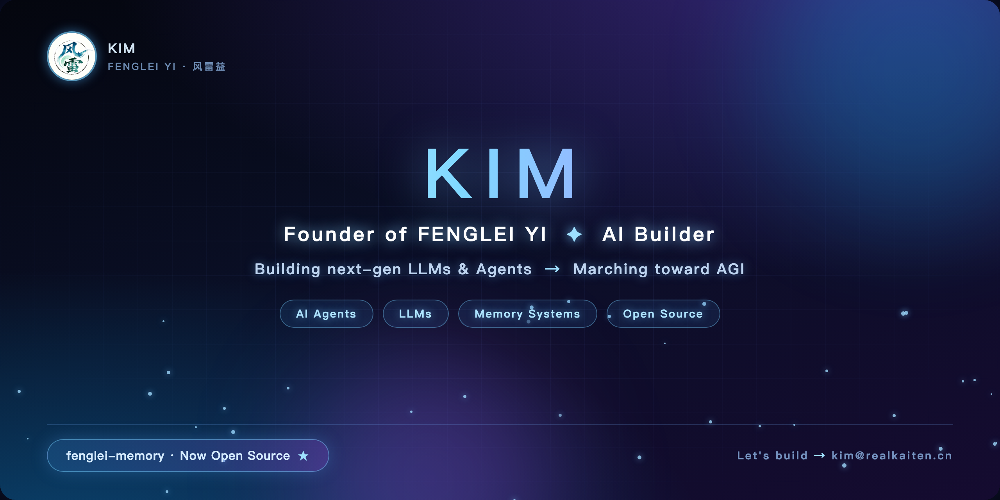
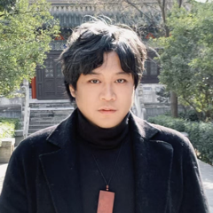

  

  <b>KIM · FENGLEI YI</b> 
  Founder of <b>FENGLEI YI</b> · Building next-gen LLMs &amp; Agents · Marching toward AGI 
  风雷益创始人 · 天施地生，其益无方

---

##  Project · Fenglei Memory · Now Open Source 风雷记忆 · 已开源

**Learn, Don't Just Store** — a four-layer memory methodology that turns experience into skill.

Most memory systems just pile up data. Fenglei Memory refines it. Built on the **Retain → Recall → Reflect → Promote** 留存 · 回忆 · 反思 · 晋升 cycle, it upgrades what an agent has truly done into reusable judgment, SOPs, and skill packs — smarter with use, not bloated.

-  **Four-Layer Architecture** — from raw facts to callable skills
-  **Promotion Triggers** — recurring patterns auto-upgrade into skills
-  **Lifecycle Management** — daily cleanup, weekly review, monthly promotion
-  **Bilingual · Zero-Dependency** — one skill file, fits any agent framework

 <b>Open Source · Bilingual · MIT License</b>

---

##  Tech Stack 技术栈

| | |
|---|---|
| **Languages** | TypeScript · Python · Bun · Node.js |
| **AI / Agents** | LLM Agents · Agent Memory · Multi-Agent Orchestration · Tool Calling · RAG · Prompt Engineering |
| **Frontend** | React · Cocos Creator · Vite · Tailwind |
| **Backend** | NestJS · Express · PostgreSQL · Redis · Docker |
| **Platforms** | Spatial OS / AR · Cross-Platform Desktop · Web |
| **Signature** | I Ching Philosophy × Artificial Intelligence |

---

##  Coming Soon 预告

###  Fenglei Ling 风雷令 — Coming Soon

> An agent that never forgets — across conversations, across agents, across devices.

New architecture · Multi-agent orchestration · Native tool calling. We are rewriting how AI remembers, decides, and acts.

**WORTH THE WAIT**

###  Lili LLM 狸狸 — In Training

> A brand-new architecture — trained from scratch, not built on the traditional Transformer stack.

No wrapper, no fork. Fully owned weights. Lighter, higher hit rate.

**WORTH THE WAIT**

More tools, more open-source skills — releasing continuously, stay tuned.

---

##  Team 团队

| | | |
|---|---|---|
|  | **KIM** · Founder · 创始人 | Vision, architecture &amp; product direction. Building the system step by step, marching toward AGI. |
|  | **CASSIA · LILY** · Co-Founder · 联合创始人 | Frontend &amp; visual design. Turning complex systems into beautiful interfaces. |

---

##  About FENGLEI YI 关于风雷益

**FENGLEI YI** — named after the "Wind &amp; Thunder" hexagram of the I Ching: wind and thunder in motion, benefit without bounds.

"Yi" means crossing great rivers — making more people better, letting more people feel the warmth of technology.

Based in China, facing the world — marching toward AGI. 风雷激荡，其益无方

---

##  Philosophy 理念

> In the age of AI, we do only one thing: **build tools that everyone can use** — no obsolescence, no anxiety.
> Technology should never replace humanity — it is simply a tool for humans to master.
> Our goal is to make tools that are easier to operate and simpler to use, so everyone can step into the AI era with ease, and make the world a better place.

在人工智能时代，我们只做一件事：做人人都能用的工具，不制造淘汰，不带来焦虑。科技从来不该淘汰人类——它只是供人类驾驭的工具。我们的目标，就是做出更方便、更简单使用的工具，让每个人都能顺利进入 AI 时代，将世界变得更加美好。

---

##  Contact 联系

   <b>Tech Exchange</b> · kimsunjian@vip.qq.com &nbsp;&nbsp;|&nbsp;&nbsp;  <b>Series A</b> · kim@realkaiten.cn

---

  If our direction resonates with you — give us a star and help more developers find us.  
   <b>Star</b>

